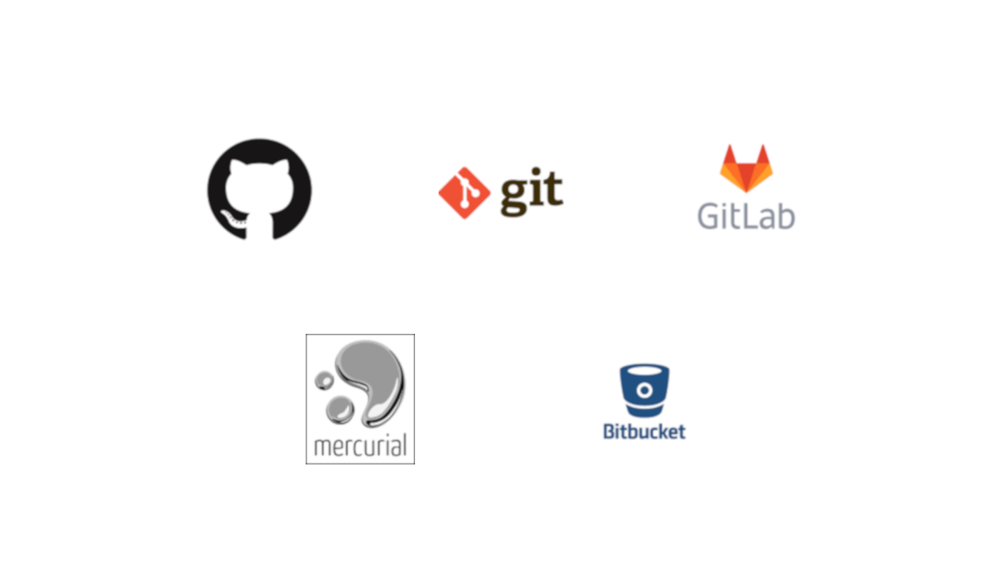
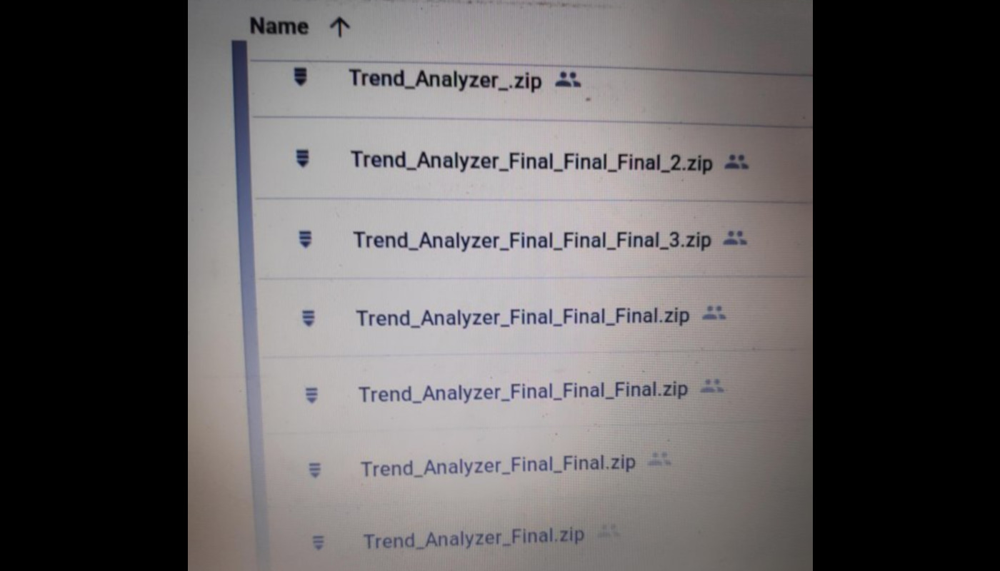

% Контроль версий в Data Science
% Андрей Григорьев
% Kazan ODSC Meetup, 21 апреля 2019

## Системы контроля версий



## Разработка ПО

* commit / push / review / merge

* Доставка в production

* Миграции в СУБД

## Контроль версий в Data Science



## Data Science

* Совместная работа с датасетами

* Прозрачность процессов предобработки данных, организация выполнения пайплайнов

* Архитектура и веса моделей, гиперпараметры, параметры кросс-валидации

* Описание инфраструктуры для запуска процесса обучения

* Артефакты - логи, метрики, примеры вывода, и т.д.

* Аналитика - журналы исследований, документация, витрины, отчеты

## Что важно для процессов Data Science

* Прозрачность - понимание истории

* Воспроизводимость - контроль окружения и зависимостей

* Эффективноcть - использование правильных инструментов

## Ресурсы

### Как оценивать

* Из чего состоят?

* Что с прозрачностью?

* Внешние или внутренние?

* Структура каталогов и веток

### Какие бывают

* Датасеты

* Jupyter Notebook

* Библиотеки (зависимости)

* IaaC - инфраструктура для запуска процессов

* Обработка данных

* Модели

* Артефакты

## Вернёмся к контролю версий

* Продумывание структуры каталогов и веток

* Использование инструментов удовлетворяющих "as a Code"

* Учимся использовать Git

## Поддерживаем порядок через структуру каталогов

https://github.com/drivendata/cookiecutter-data-science

* `data/...`

* `models/`

* `notebooks/`

* `src/...`

* и т.д.

## Правильно храним данные

* Локальная ФС

  * Copy vs Symlink / Hardlink / Reflink

  * Системы бэкапов

* Удаленная система хранения

  * Облачные провайдеры

  * Свой сервер - SSH, CIFS, Minio

  * Git LFS

* Специализированная система

  * pachyderm

  * databricks

## DVC

* `dvc init`

* `.dvc/cache`

* `.dvc/config`

* `--no-scm`

* Dvcfile, `*.dvc`

## Добавление файлов - датасет

```bash
$ echo a 1 2 3 > raw.txt
$ echo b 2 3 4 >> raw.txt
$ dvc add raw.txt
```

## Dvcfile

```
$ cat raw.txt.dvc
md5: 6eca568e94be55f5874da61c28ebb7fa
outs:
- cache: true
  md5: 90c619438fe952e7bf375ff0bc78d179
  metric: false
  path: raw.txt
  persist: false
wdir: .
```

## Добавление файлов - обработанные данные

```bash
$ dvc run -d raw.txt -o data.txt "grep a raw.txt > data.txt"
$ cat data.txt.dvc
cmd: grep a raw.txt > data.txt
deps:
- md5: 90c619438fe952e7bf375ff0bc78d179
  path: raw.txt
md5: e3001906da7d3b9fbe5866899f0c5b2c
outs:
- cache: true
  md5: e98e8f79b70a540b2fbe54b6e3d61159
  metric: false
  path: data.txt
  persist: false
wdir: .
```

## Вернемся к reflink / hardlink / symlink

* `dvc config cache.type`
  * `reflink`
  * `hardlink`
  * `symlink`
  * `copy`

* `dvc config cache.protected true`

* `dvc unprotect raw.txt`

## Воспроизведение процессов

```
$ echo a 3 4 5 > raw.txt
$ echo b 4 5 6 >> raw.txt
$ dvc repro data.txt.dvc
$ cat data.txt
a 3 4 5
```

## Внесение изменений и навигация по версиям

Обновляем Dvcfile:

```
    $ dvc commit
```

Восстанавливаем данные:

```
    $ git checkout [...]
    $ dvc checkout [raw.txt.dvc]
```

## Публикация и получение

Добавляем сервер и отправляем туда данные:

```
    $ dvc remote add myserver ssh://example.com/absolute/path
    $ dvc push -r myserver
```

Как получить копию:

```
    $ git clone ...
    $ dvc pull -r myserver
    $ dvc checkout
```

## Хак с rclone

```
    $ rclone copy .dvc/cache yandex_disk:myrepo/
```

## Community

Документация: https://dvc.org/

Github: https://github.com/iterative/dvc/

Discord: https://dvc.org/chat

Forum: https://discuss.dvc.org/

## 

|                              Спасибо за внимание

##

|                                      Вопросы
